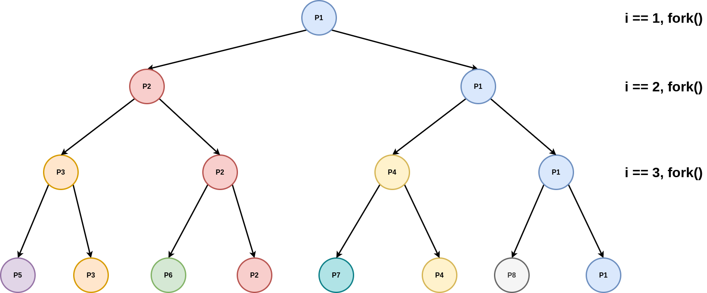

# Week 02 Tutorial

## Overview
- Administrivia
- Motivation
- Tutorial Questions

---

## Administrivia
- Welcome to OS!
- Please ask heaps of questions during tutorials :-)
- The [Ed forum](https://edstem.org/courses/5289/discussion/) is generally the best place to ask questions outside of tutorials
- Tutorial feedback form [here](https://forms.gle/u4kxPGNzw7ameZub8)

---

## Motivation

Why study operating systems?

One answer: allows you to better answer the question "How does a computer work?"

---

## Tutorial Questions

### Q2

What are the two main roles of an Operating System?

- It provides a high-level abstract machine for programmers (hides the details of the hardware)
- It is a resource manager that divides resources amongst competing programs or users according to some system policy.

---

### Q1

What are some of the differences between a processor running in privileged mode (also called kernel mode) and user mode? Why are the two modes needed?

User-mode:
- CPU control registers are inaccessible (e.g. register responsible for disabling interrupts)
  - Why would it be bad if a user application could disable interrupts?
- CPU management instructions are inaccessible (e.g. the [clear interrupts aka CLI instruction on x86](https://www.felixcloutier.com/x86/cli))
- Parts of the address space (containing kernel code and data) are inaccessible.
- Some device memory and registers (or ports) are inaccessible.

The two modes of operation are required to ensure that applications (running in user-mode) cannot bypass, circumvent, or take control of the operating system.

---

## `fork`, `exec`, and `waitpid`

On unix systems, processes are created (aka 'spawned') using the [`fork-exec` model](https://en.wikipedia.org/wiki/Fork%E2%80%93exec). That is; to create a new process, we create a copy of the current process (`fork`) and then replace the process memory image (code, data, etc.) with another program (`exec`). The first process created when a system boots up is called the [init process](https://en.wikipedia.org/wiki/Init).

What happens when we execute the command `echo hello world`?

See `shelly.c` and `shelly-soln.c`.

If you're curious why one might use `fork` and `exec` rather than something like `spawn`, see here: https://unix.stackexchange.com/questions/136637/why-do-we-need-to-fork-to-create-new-processes, and here: https://unix.stackexchange.com/questions/31118/why-is-the-default-process-creation-mechanism-fork

---

## Q5

The following code contains the use of typical UNIX process management system calls: `fork()`, `execl()`, `exit()` and `getpid()`. If you are unfamiliar with their function, browse the man pages on a UNIX/Linux machine get an overview, e.g: `man fork`

What does this program do?

```C
#include <sys/types.h>
#include <unistd.h>
#include <stdlib.h>
#include <stdio.h>

#define FORK_DEPTH 3

main()
{
  int i, r;
  pid_t my_pid;

  my_pid = getpid();
  
  for (i = 1; i <= FORK_DEPTH; i++) {
    
    r = fork();
    
    if (r > 0) {
      /* we're in the parent process after
         successfully forking a child */
      
      printf("Parent process %d forked child process %d\n",my_pid, r);  
      
    } else if (r == 0) {
      
      /* We're in the child process, so update my_pid */
      my_pid = getpid();
      
      /* run /bin/echo if we are at maximum depth, otherwise continue loop */
      if (i == FORK_DEPTH) { 
        r = execl("/bin/echo","/bin/echo","Hello World",NULL);
        
        /* we never expect to get here, just bail out */
        exit(1);
      }
    } else { /* r < 0 */
      /* Eek, not expecting to fail, just bail ungracefully */
      exit(1);
    }
  }
}
```

What does fork do?

From `man fork`

> fork() creates a new process by duplicating the calling process. The new process is referred to as the child process. The calling process is referred to as the parent process.

It's often not that useful to just duplicate the calling process. Sometimes we'll want the new process to do something else, different to the parent. What can we use for that?

Introducing... the `exec()` family!

> The exec() family of functions replaces the current process image with a new process image.

There are a bunch of different `exec` 'front-end' functions in this family, but they all call the same 'back-end' system call; `execve()`. The ['fork and exec' pattern](https://en.wikipedia.org/wiki/Fork-exec) is common in systems programming. That's how the shell executes programs.


Let's look at a diagram.



What is the value of `i` in the parent and child after fork?

This manual excerpt might help us answer...

> The child process and the parent process run in separate memory spaces. **At the time of fork() both memory spaces have the same content**.

The memory spaces have the same content, so the value of `i` in the child will be the same as whatever it was in the parent before the fork.

What is the value of `my_pid` in a parent after a child updates it?

This manual excerpt might help us answer...

> Memory writes, file mappings (mmap(2)), and unmappings (munmap(2)) performed by one of the processes do not affect the other

The parent and child have separate and independent virtual address spaces, so the value of `my_pid` in the parent won't be affected by the update performed in the child.

What is the process id of `/bin/echo`?

`/bin/echo` isn't a process, and doesn't have a process id. It's an executale file. `execl` will replace the content of the running process (stack, heap, data, etc.) with the executable specified by the pathname given as the first argument to it. The process id of the caller of `execl` (in this case, the child) won't change.

Why is the code after execl not expected to be reached in the normal case?

Remember that `execl` is going to replace the entire process image (i.e. the binary executable) with another one, so whatever code was left to execute in the original process is going to be replaced with code in the new process.

We can also confirm this in the manual:

> The exec() functions return only if an error has occurred.  The return value is -1, and errno is set to indicate the error.

This is a common pattern in systems programming, which you will likely follow in your assignments.

How many times is Hello World printed when FORK_DEPTH is 3?

"Hello World" is printed in every child process where `FORK_DEPTH == 3`. Lets use this knowledge and the diagram to answer this question.

How many processes are created when running the code (including the first process)?

See diagram.

---

## Q6

What does the following code do?

```C
#include <sys/types.h>
#include <sys/stat.h>
#include <fcntl.h>
#include <stdio.h>
#include <stdlib.h>
#include <string.h>

char teststr[] = "The quick brown fox jumps over the lazy dog.\n";

main()
{
  int fd;
  int len;
  ssize_t r;


  fd = open("testfile", O_WRONLY | O_CREAT, 0600);
  if (fd < 0) {
    /* just ungracefully bail out */
    perror("File open failed");
    exit(1);
  }
  
  len = strlen(teststr);
  printf("Attempting to write %d bytes\n",len);
  
  r = write(fd, teststr, len);

  if (r < 0) {
    perror("File write failed");
    exit(1);
  }
  printf("Wrote %d bytes\n", (int) r);
  
  close(fd);

}
```

This program opens a file named "testfile" and writes the string "The quick brown fox jumps over the lazy dog.\n" to it. The access mode is write-only, and it will create the file if it doesn't already exist. The permissions (0600) are for reading and writing, but not executing.

In addition to `O_WRONLY`, what are the other 2 ways one can open a file?

We could also open it `O_RDONLY`, or `O_RDWR`.

What does open return in `fd`, what is it used for? Consider success and failure in your answer.

In case of failure `fd` is set to `-1` to signify an error, and `errno` will be set to indicate the type of error that occurred (e.g. `ENOMEM: Insufficient kernel memory was available`). In the case of success, `fd` is set to a file descriptor (an integer) that becomes a handle to the file. The file descriptor is used in the other file related systems cases to identify the file to operate on.

A file descriptor is just index into an open file table maintained by the kernel for each process. You'll learn more about this in assignment 2.

---

## Q7

The following code is a variation of the previous code that writes twice.

```C
#include <sys/types.h>
#include <sys/stat.h>
#include <fcntl.h>
#include <stdio.h>
#include <stdlib.h>
#include <string.h>

char teststr[] = "The quick brown fox jumps over the lazy dog.\n";

main()
{
  int fd;
  int len;
  ssize_t r;
  off_t off;


  fd = open("testfile2", O_WRONLY | O_CREAT, 0600);
  if (fd < 0) {
    /* just ungracefully bail out */
    perror("File open failed");
    exit(1);
  }
  
  len = strlen(teststr);
  printf("Attempting to write %d bytes\n",len);
  
  r = write(fd, teststr, len);

  if (r < 0) {
    perror("File write failed");
    exit(1);
  }
  printf("Wrote %d bytes\n", (int) r);

  off = lseek(fd, 5, SEEK_SET);
  if (off < 0) {
    perror("File lseek failed");
    exit(1);
  }

  r = write(fd, teststr, len);

  if (r < 0) {
    perror("File write failed");
    exit(1);
  }
  printf("Wrote %d bytes\n", (int) r);
  
  close(fd);

}
```

How big is the file (in bytes) after the two writes?

`lseek(fd, 5, SEEK_SET)` will reposition the file offset (current cursor position) from wherever it was to absolute byte number `5`.

So the size of the file will be `strlen(teststr) + 5` bytes.

What is `lseek()` doing that is affecting the final file size?

`lseek` sets the current offset to a specific location in the file. The lseek in the code moves the current offset from 45 bytes (after the initial write) to 5 bytes from the start of the file. The second write begins from offset 5, writes 45 bytes, giving 50 bytes in total in the file.

What over options are there in addition to `SEEK_SET?`.

`SEEK_CUR`, and `SEEK_END`.

---

## Q8

Compile either of the previous two code fragments on a UNIX/Linux machine and run strace ./a.out and observe the output.

What does `strace` do?

> In the simplest case strace runs the specified command until it exits. It intercepts and records the system calls which are called by a process and the signals which are received by a process. The name of each system call, its arguments and its return value are printed on standard error or to the file specified with the -o option.

`strace` is pretty cool. It can tell you a lot about what a program is doing without having access to the source code.

What's the very first system call that we should expect to see when running strace ./a.out from the shell? Do you remember how the shell executes programs?

```sh
$ gcc q7.c -o q7
$ strace ./q7
execve("./q7", ["./q7"], 0x7ffcdf051d20 /* 56 vars */) = 0
brk(NULL)                               = 0x5641b92ed000
arch_prctl(0x3001 /* ARCH_??? */, 0x7ffc8d478480) = -1 EINVAL (Invalid argument)
access("/etc/ld.so.preload", R_OK)      = -1 ENOENT (No such file or directory)
openat(AT_FDCWD, "/etc/ld.so.cache", O_RDONLY|O_CLOEXEC) = 3
fstat(3, {st_mode=S_IFREG|0644, st_size=87347, ...}) = 0
mmap(NULL, 87347, PROT_READ, MAP_PRIVATE, 3, 0) = 0x7fbee200a000
close(3)                                = 0
openat(AT_FDCWD, "/lib/x86_64-linux-gnu/libc.so.6", O_RDONLY|O_CLOEXEC) = 3
read(3, "\177ELF\2\1\1\3\0\0\0\0\0\0\0\0\3\0>\0\1\0\0\0\360q\2\0\0\0\0\0"..., 832) = 832
pread64(3, "\6\0\0\0\4\0\0\0@\0\0\0\0\0\0\0@\0\0\0\0\0\0\0@\0\0\0\0\0\0\0"..., 784, 64) = 784
pread64(3, "\4\0\0\0\20\0\0\0\5\0\0\0GNU\0\2\0\0\300\4\0\0\0\3\0\0\0\0\0\0\0", 32, 848) = 32
pread64(3, "\4\0\0\0\24\0\0\0\3\0\0\0GNU\0\t\233\222%\274\260\320\31\331\326\10\204\276X>\263"..., 68, 880) = 68
fstat(3, {st_mode=S_IFREG|0755, st_size=2029224, ...}) = 0
mmap(NULL, 8192, PROT_READ|PROT_WRITE, MAP_PRIVATE|MAP_ANONYMOUS, -1, 0) = 0x7fbee2008000
pread64(3, "\6\0\0\0\4\0\0\0@\0\0\0\0\0\0\0@\0\0\0\0\0\0\0@\0\0\0\0\0\0\0"..., 784, 64) = 784
pread64(3, "\4\0\0\0\20\0\0\0\5\0\0\0GNU\0\2\0\0\300\4\0\0\0\3\0\0\0\0\0\0\0", 32, 848) = 32
pread64(3, "\4\0\0\0\24\0\0\0\3\0\0\0GNU\0\t\233\222%\274\260\320\31\331\326\10\204\276X>\263"..., 68, 880) = 68
mmap(NULL, 2036952, PROT_READ, MAP_PRIVATE|MAP_DENYWRITE, 3, 0) = 0x7fbee1e16000
mprotect(0x7fbee1e3b000, 1847296, PROT_NONE) = 0
mmap(0x7fbee1e3b000, 1540096, PROT_READ|PROT_EXEC, MAP_PRIVATE|MAP_FIXED|MAP_DENYWRITE, 3, 0x25000) = 0x7fbee1e3b000
mmap(0x7fbee1fb3000, 303104, PROT_READ, MAP_PRIVATE|MAP_FIXED|MAP_DENYWRITE, 3, 0x19d000) = 0x7fbee1fb3000
mmap(0x7fbee1ffe000, 24576, PROT_READ|PROT_WRITE, MAP_PRIVATE|MAP_FIXED|MAP_DENYWRITE, 3, 0x1e7000) = 0x7fbee1ffe000
mmap(0x7fbee2004000, 13528, PROT_READ|PROT_WRITE, MAP_PRIVATE|MAP_FIXED|MAP_ANONYMOUS, -1, 0) = 0x7fbee2004000
close(3)                                = 0
arch_prctl(ARCH_SET_FS, 0x7fbee2009540) = 0
mprotect(0x7fbee1ffe000, 12288, PROT_READ) = 0
mprotect(0x5641b7842000, 4096, PROT_READ) = 0
mprotect(0x7fbee204d000, 4096, PROT_READ) = 0
munmap(0x7fbee200a000, 87347)           = 0
openat(AT_FDCWD, "testfile2", O_WRONLY|O_CREAT, 0600) = 3
fstat(1, {st_mode=S_IFCHR|0620, st_rdev=makedev(0x88, 0x1), ...}) = 0
brk(NULL)                               = 0x5641b92ed000
brk(0x5641b930e000)                     = 0x5641b930e000
write(1, "Attempting to write 45 bytes\n", 29Attempting to write 45 bytes
) = 29
write(3, "The quick brown fox jumps over t"..., 45) = 45
write(1, "Wrote 45 bytes\n", 15Wrote 45 bytes
)        = 15
lseek(3, 5, SEEK_SET)                   = 5
write(3, "The quick brown fox jumps over t"..., 45) = 45
write(1, "Wrote 45 bytes\n", 15Wrote 45 bytes
)        = 15
close(3)                                = 0
exit_group(0)                           = ?
+++ exited with 0 +++
```

What is `strace` doing?

`strace` is printing a trace of all system calls invoked by a process, together with the arguments to the system call. There are a lot of system calls at the beginning of a trace related to dynamically loading code libraries. Towards the end of the trace you will see the system calls you expect to see.

Without modifying the above code to print `fd`, what is the value of the file descriptor used to write to the open file?

`printf` does not appear in the system call trace. What is appearing in it's place? What's happening here?

`printf` is a library function that creates a buffer based on the string specification that it is passed. The buffer is then written to the console using write() to file descriptor 1 (i.e. stdout).

---

## Q9

Compile and run the following code.

```C
#include <unistd.h>
#include <stdlib.h>
#include <stdio.h>
#include <errno.h>

main()
{
  int r;
  r = chdir("..");
  if (r < 0) {
    perror("Eek!");
    exit(1);
  }
  
  r = execl("/bin/ls","/bin/ls",NULL);
  perror("Double eek!");
}
```

What does it do?

The code sets the current working directory of the process to be the parent directory (one higher in the directory hierarchy), and then runs `ls` to list the directory.

After the program runs, the current working directory of the shell is the same. Why?

The shell forks a child process that runs the code. Each process has its own current working directory, so the code above changes the current working directory of the child process, the current working directory of the parent process remains the same.

In what directory does `/bin/ls` run in? Why?

`exec` replaces the content of the child process with `ls`, not the environment the child process runs in. The current working directory is part of the environment that the OS manages on behalf of every process, so `ls` runs in the current directory of child process.

---

## Q10

On UNIX, which of the following are considered system calls? Why?

1. `read()`
2. `printf()`
3. `memcpy()`
4. `open()`
5. `strncpy()`

1 and 4 are system calls, 2 is a C library functions which can call `write()`, 3 and 5 a simply library functions.

---

## Q11

In the three-state process model, what do each of the three states signify? What transitions are possible between each of the states, and what causes a process (or thread) to undertake such a transition?

The three states are: Running, the process is currently being executed on the CPU; Ready, the process is ready to execute, but has not yet been selected for execution by the dispatcher; and Blocked where the process is not runnable as it is waiting for some event prior to continuing execution.

Possible transitions are Running to Ready, Ready to Running, Running to Blocked, and Blocked to Ready.

Events that cause transitions:
- Running to Ready: timeslice expired, yield, or higher priority process becomes ready.
- Ready to Running: Dispatcher chose the next thread to run.
- Running to Blocked: A requested resource (file, disk block, printer, mutex) is unavailable, so the process is blocked waiting for the resource to become available.
- Blocked to Ready: a resource has become available, so all processes blocked waiting for the resource now become ready to continue execution.

---

## Q14

The following fragment of code is a single line of code. How might a race condition occur if it is executed concurrently by multiple threads? Can you give an example of how an incorrect result can be computed for `x`.

```C
x = x + 1;
```

The single code statement is compiled into multiple machine instructions. The assembly instructions will roughly look something like this:
```mips
lw    RegDest,  AddrX
addi  RegDest,  RegDest,  1
sw    RegDest,  AddrX
```

Let's imagine two threads execute these three machine instructions concurrently (i.e. no guarantee about the timing of when each thread will execute each instruction relative to the other thread). Can you think of an example of how one thread may compute an incorrect result for `x`?

| P1                            | P2                            |
| ----------------------------- | ----------------------------- |
| `lw    RegDest,  AddrX`       | X                             |
| X                             | `lw    RegDest,  AddrX`       |
| X                             | `addi  RegDest,  RegDest,  1` |
| X                             | `sw    RegDest,  AddrX`       |
| `addi  RegDest,  RegDest,  1` | X                             |
| `sw    RegDest,  AddrX`       | X                             |

In this case, `x` has been incremented twice (once by each process), but P1 has overriden the increment that P2 made :-(.

During the interval between the load and store in the first thread, another thread may perform a load, increment, and store, and when control passes back to the first thread, the results of the second are overwritten are them overwritten. Another outcome would be for the results of the first to be overwritten by the second (as the first thread loads, increments, then the second thread loads, increments, then the first thread stores, then the second thread stores).

See increment example on https://godbolt.org/.

---

## Q16

The following function is called by threads in a multi-thread program. Under what conditions would it form a critical section.

What's a critical section?

A [critical section](https://en.wikipedia.org/wiki/Critical_section) is a section of code where a shared resource is accessed e.g. two threads accessing the same global variable.

```C
void inc_mem(int *iptr)
{
    *iptr = *iptr + 1;
}
```

Whether `*iptr = *iptr + 1` forms a critical section depends on the scope of the pointer passed to `inc_mem`. If the pointer points to a local variable, then there is no race. If the pointer points to a shared global variable there is potential for a race, and thus the increment would become a critical section.
